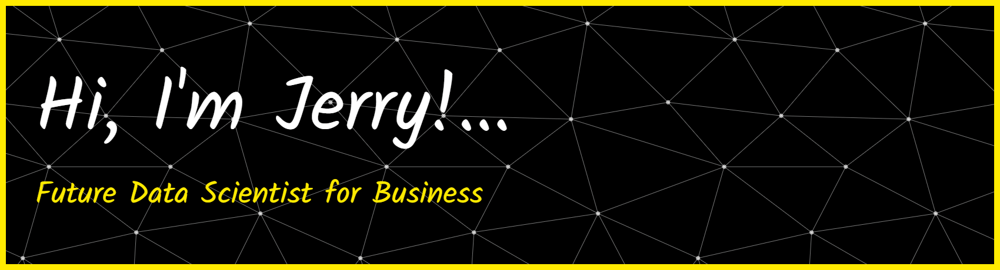

##
## 

## 📝 About Me
I am a **Data Science for Business student** building the bridge between raw data and strategic insight.  
My focus is on developing analytical thinking, Python-driven solutions, and data architectures that help organizations make smarter, faster decisions.

Curious by nature, and driven by growth — I believe data is not just numbers, but **stories waiting to be told**.

## 🧠 What I do
- 📊 Data analysis & visualization  
- 🐍 Python programming & automation  
- 🎓 Business-oriented academic projects  
- ⚙️ Building strong foundations in data engineering  

## 💼 Experience
Before getting into technology, I worked as a warehouse assistant and in production, where I developed:
- **Operational discipline** and process optimization mindset.  
- **Team collaboration** in high-demand environments.  
- **Real-world understanding** of logistics and efficiency.  

Today, I translate that operational experience into **data-driven problem solving**.

## 🚩 Featured Projects
### 🔹 Rainwater Harvesting System  
**Python-based simulation for sustainable resource optimization**

- **Core:** Volumetric estimation & storage optimization models.  
- **Impact:** Sustainability-focused solution for university infrastructure.  
- **Skills:** Mathematical modeling, logic optimization, predictive analysis.  

> *Designing systems where every drop — and every data point — counts.*

## 🖥️ Technologies

### Learning & Exploring

  
  
  
  
  

> *Currently deepening my knowledge in Python libraries (Pandas/NumPy/Matplotlib), MySQL data structures, and basic 3D modeling for data viz.*

## 📊 GitHub Statistics

  
  

## 📫 Let’s connect 

  
  
  
  
  
  

  <i>“Data is the compass. Curiosity is the engine. Growth is the destination.”</i>

